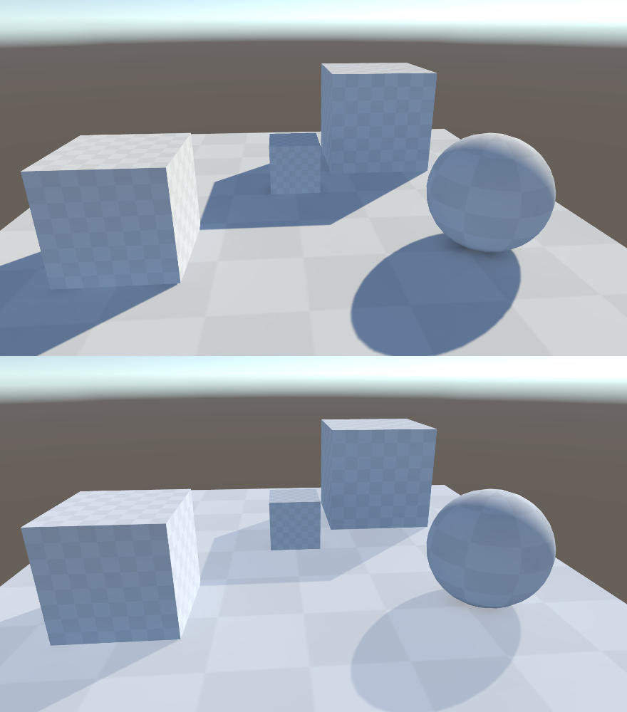

StandardSurfFadeLightmap

Modified Unity Standard Surface Shader with a few post-processing options for light mapping.

Gives the ability to adjust lightmapping data output in surface shader:
- Fade lightmap light
- Adjust lightmap light contrast
- Adjust lightmap light gamma
- Fade lightmap indirect diffuse

